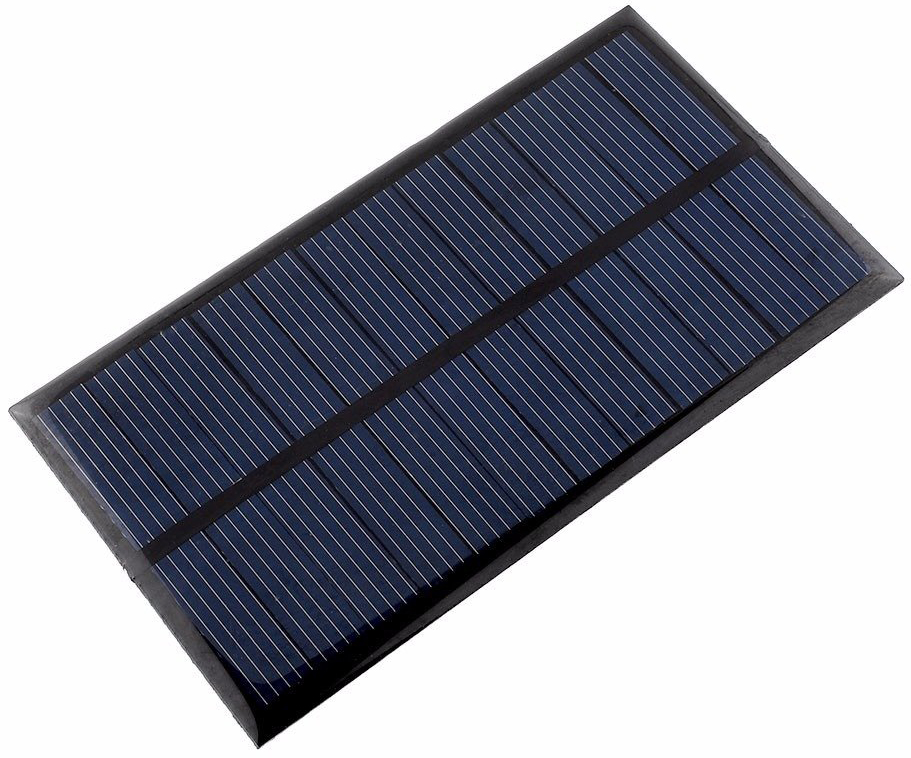
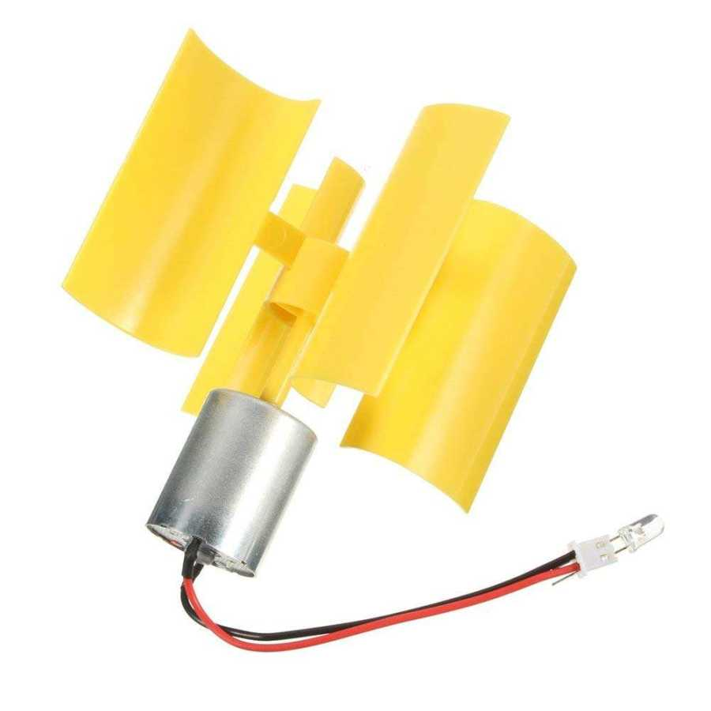
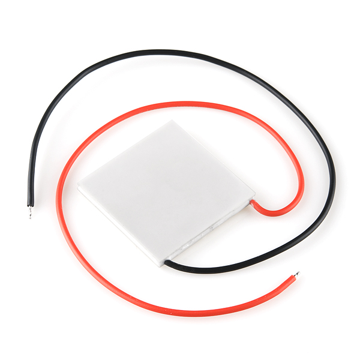
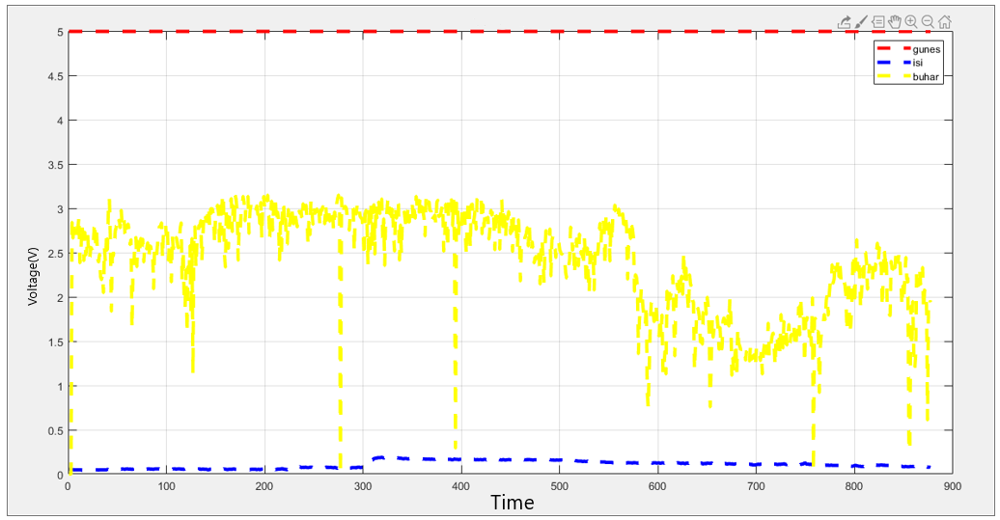

# Thesis
 **The aim of this project is to measure the efficiency of small-scale systems with arduino, so that if we build a system, we see the energy that we will gain. Renewable energy sources are not harm the nature, even it is produced by benefiting from the nature. Arduino can be used like a brain and it performs recording, displaying and controlling the operates. The data from Arduino can be transfered to MATLAB to observe graphically. It allows us to see which system can produce more energy about productivity and errors that may occur.**
## Solar Panel
 **Solar panels collect clean renewable energy in the form of sunlight and convert that light into electricity which can then be used to provide power for electrical loads.**

 
 ## Steam Turbine
 **I used it as a wind turbine in this project. Wind turbine is a machine that converts kinetic energy from the wind into electricity.**
 
 
 
  ## Peltier Module
 **This module generates electrical energy due to the temperature difference between the two surfaces.**
  
 
# Result Graph 
 
**<ul>Solar Panel output is red line.</ul>** 
**<ul>Steam Turbine output is yellow line.</ul>**
**<ul>Peltier Module output is blue line.</ul>**
  
 
 
 **Peltier Module, Steam Turbine and Solar Panel Measurements**
 **<ul>Solar Panel Module:</ul>**
 <ul>- Maximum measured voltage: 5V</ul>
 <ul>- Maximum measured current: 16,8mA</ul>
 
 **<ul>Peltier Module:</ul>**
 <ul>-Maximum measured voltage: 0,5V</ul>
 <ul>-Maximum measured current: 410mA</ul>
 
 **<ul>Steam Turbine Module:</ul>**
 <ul>- Maximum measured voltage: 3,4V</ul>
 <ul>- Maximum measured current: 198,7mA</ul>
 
 
